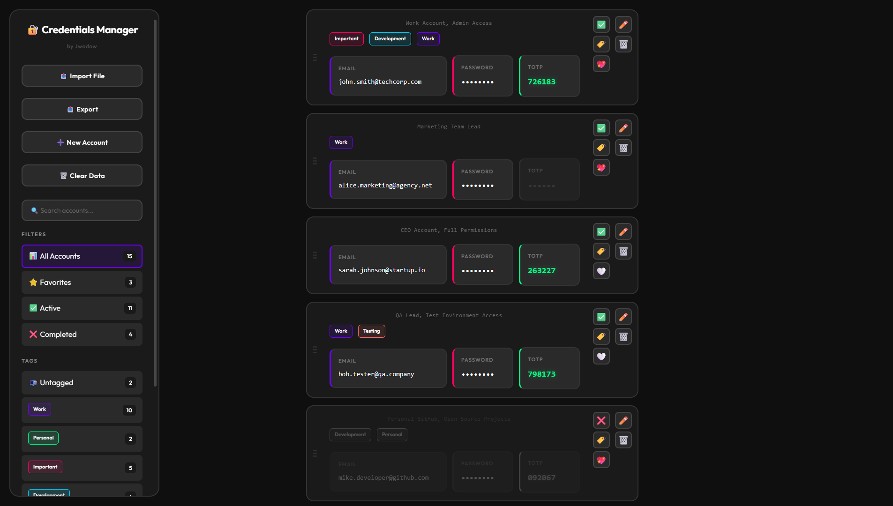

<div align="center">

# 🔐 Credentials Manager

**Secure local credentials manager with TOTP support**

Made with ❤️ by [@Jwadow](https://github.com/jwadow)

[](https://www.gnu.org/licenses/agpl-3.0)
[](https://developer.mozilla.org/en-US/docs/Web/HTML)
[](https://developer.mozilla.org/en-US/docs/Web/JavaScript)
[](#-support-the-project)

**Manage your credentials locally with tags, filters, TOTP generation, and import/export — no installation required**

[Features](#-features) • [Quick Start](#-quick-start) • [Usage](#-usage) • [💖 Donate](#-support-the-project)

<br>

<a href="assets/screenshot.png">
  
</a>

*Click image to view full size*

</div>

---

## 🔒 Privacy & Security

**100% Local, 100% Private**

- All data stored in browser's localStorage
- No external requests (except self-hosted fonts)
- Works completely offline
- No analytics, no tracking, no telemetry
- Your credentials never leave your computer

---

## ✨ Features

### 📊 Credentials Management
- **Email/Password/TOTP** - Store login credentials with 2FA secrets
- **Extra info** - Add usernames, notes, or any additional data
- **Tags** - Organize accounts with custom colored tags
- **Favorites** - Mark important accounts for quick access
- **Completion status** - Track used/unused accounts

### 🔍 Search & Filter
- **Real-time search** - Find accounts instantly by email, tags, or extra info
- **Tag filtering** - Filter by one or multiple tags
- **Status filters** - Show all, active, completed, or favorites
- **Untagged filter** - Find accounts without tags

### 🔐 TOTP Generation
- **Built-in authenticator** - Generate 2FA codes without external apps
- **Auto-refresh** - Codes update every 30 seconds
- **One-click copy** - Copy codes to clipboard instantly
- **Visual indicators** - See which accounts have 2FA enabled

### 📥 Import/Export
- **TXT import** - Parse credentials from text files with custom delimiters
- **JSON backup** - Full backup with tags and metadata
- **Smart merging** - Avoid duplicates, preserve TOTP secrets
- **Flexible format** - Support for various delimiters (|, :, ;, etc.)

### 🎨 User Interface
- **Drag & drop** - Reorder accounts, add tags by dragging
- **Dark theme** - Easy on the eyes
- **Responsive design** - Works on desktop and mobile
- **Keyboard shortcuts** - Ctrl+F (search), Ctrl+N (new account), Ctrl+E (export)

### 🛠️ Advanced Features
- **Batch operations** - Import hundreds of accounts at once
- **Duplicate detection** - Smart merging prevents data loss
- **Context menus** - Right-click tags for quick actions

---

## 🚀 Quick Start

### Prerequisites

**None!** Just a modern web browser (Chrome, Firefox, Edge, Safari).

### Installation

```bash
# Clone the repository
git clone https://github.com/jwadow/credentials-manager.git
cd credentials-manager

# Open in browser (or use terminal below)
# Windows
start index.html

# macOS
open index.html

# Linux
xdg-open index.html
```

*No Git? Click "Code" → "Download ZIP" at the top of this page, extract, and open `index.html` in your browser.*

That's it! No installation, no dependencies, no build process.

---

## 💡 Usage

### Adding Accounts

1. Click **"➕ New Account"** button
2. Fill in email and password (required)
3. Add TOTP secret if you have 2FA (optional, 32 characters)
4. Add extra info like username or notes (optional)
5. Click **"Add"**

### Importing from File

1. Click **"📥 Import File"**
2. Select your TXT or JSON file
3. Choose delimiter (auto-detected for TXT files)
4. Preview and confirm import

**TXT file format (example for "|" delimiter):**
```
email@example.com|password123|TOTPSECRET32CHARS|extra info
another@example.com|pass456|extra info
third@example.com|qwerty123
```

**JSON file format:**
```json
{
  "version": "1.0",
  "accounts": [...],
  "tags": [...]
}
```

### Organizing with Tags

- **Create tags:** Click "➕ New Tag" in sidebar
- **Add tags:** Click 🏷️ button on account card
- **Drag to tag:** Drag account card onto tag in sidebar
- **Filter by tag:** Click tag in sidebar to filter
- **Edit/Delete:** Right-click tag for context menu

### Exporting Data

1. Click **"📤 Export"**
2. Choose scope (all, favorites, or active)
3. Choose format (TXT or JSON configuration)
4. For TXT: select fields and delimiter
5. Click **"Export"** to download

---

## 🎯 Use Cases

- **Password manager alternative** - Lightweight, no cloud sync
- **Bulk account management** - Import/export hundreds of accounts
- **2FA backup** - Store TOTP secrets for recovery
- **Account organization** - Tag accounts by project, client, or category
- **Temporary storage** - Manage credentials during migrations

---

## 📜 License

This project is licensed under the **GNU Affero General Public License v3.0 (AGPL-3.0)**.

This means:
- ✅ You can use, modify, and distribute this software
- ✅ You can use it for commercial purposes
- ⚠️ **You must disclose source code** when you distribute the software
- ⚠️ **Network use is distribution** — if you run a modified version on a server and let others interact with it, you must make the source code available
- ⚠️ Modifications must be released under the same license

See the [LICENSE](LICENSE) file for the full license text.

### Why AGPL-3.0?

AGPL-3.0 ensures that improvements to this software benefit the entire community. If you modify this tool and deploy it as a service, you must share your improvements with your users.

---

## 💖 Support the Project

<div align="center">


**If this project saved you time or helped you stay organized, consider supporting it!**

Every contribution helps keep this project alive and growing

<br>

### 🤑 Donate

[**☕ One-time Donation**](https://app.lava.top/jwadow?tabId=donate) • [**💎 Monthly Support**](https://app.lava.top/jwadow?tabId=subscriptions)

<br>

### 🪙 Or send crypto

| Currency | Network | Address |
|:--------:|:-------:|:--------|
| **USDT** | TRC20 | `TSVtgRc9pkC1UgcbVeijBHjFmpkYHDRu26` |
| **BTC** | Bitcoin | `12GZqxqpcBsqJ4Vf1YreLqwoMGvzBPgJq6` |
| **ETH** | Ethereum | `0xc86eab3bba3bbaf4eb5b5fff8586f1460f1fd395` |
| **SOL** | Solana | `9amykF7KibZmdaw66a1oqYJyi75fRqgdsqnG66AK3jvh` |
| **TON** | TON | `UQBVh8T1H3GI7gd7b-_PPNnxHYYxptrcCVf3qQk5v41h3QTM` |

</div>

---

## 💬 Need Help?

Got questions? Found a bug? Have a feature idea?

**👉 [Open an Issue on GitHub](https://github.com/jwadow/credentials-manager/issues/new)**

---

<div align="center">

**[⬆ Back to Top](#-credentials-manager)**

</div>
